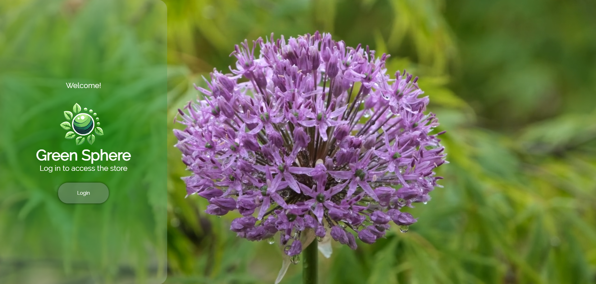
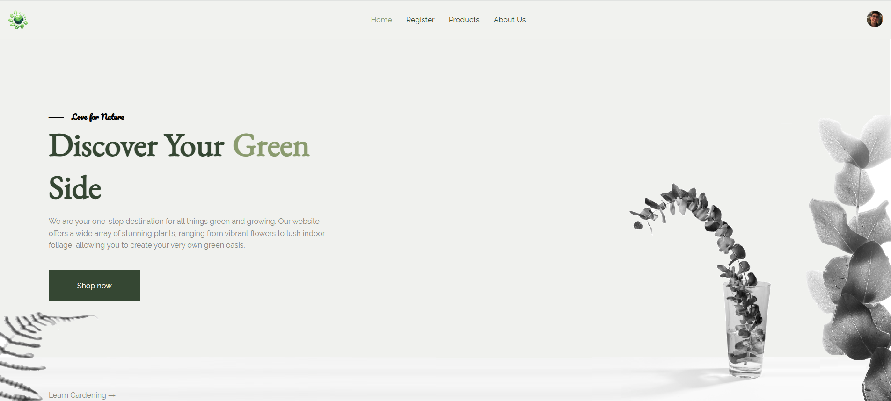
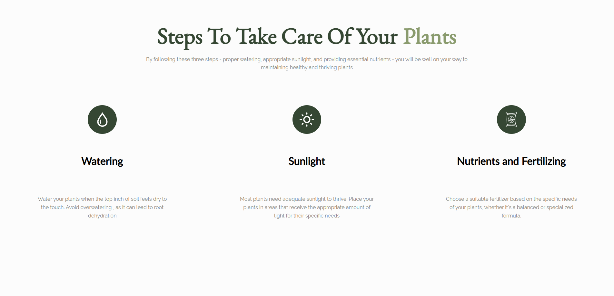
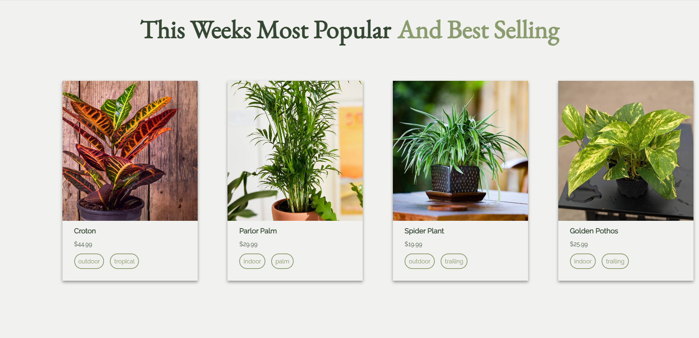
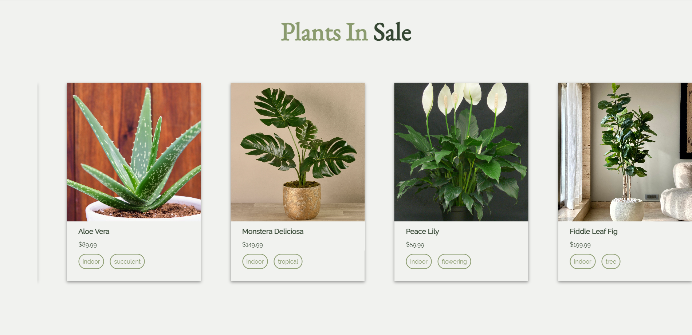
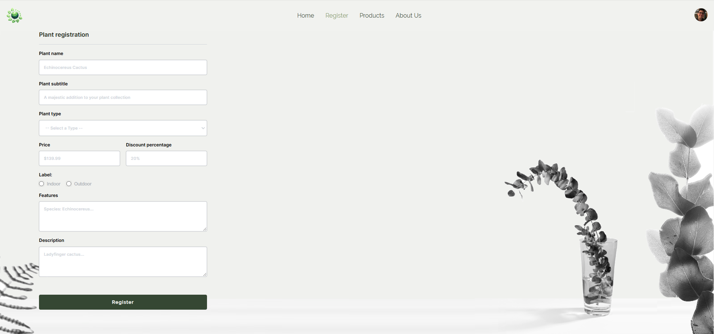
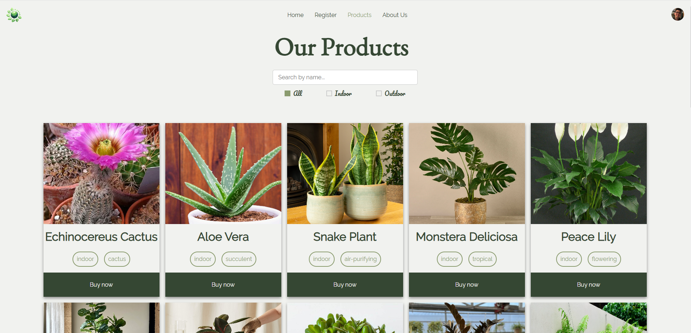
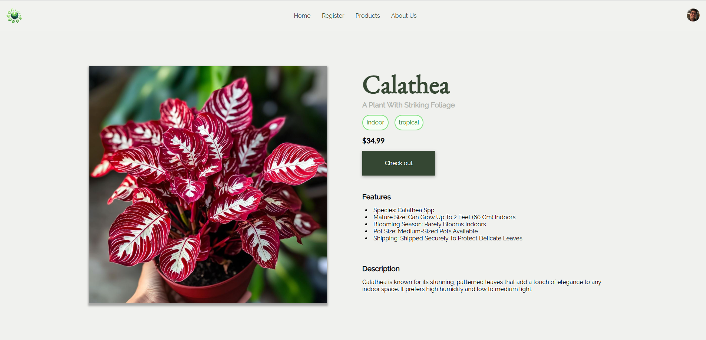
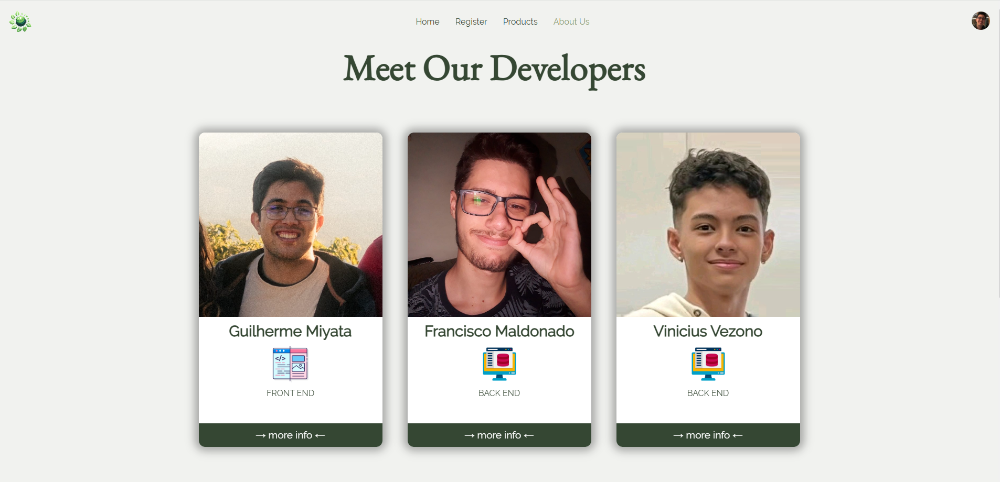
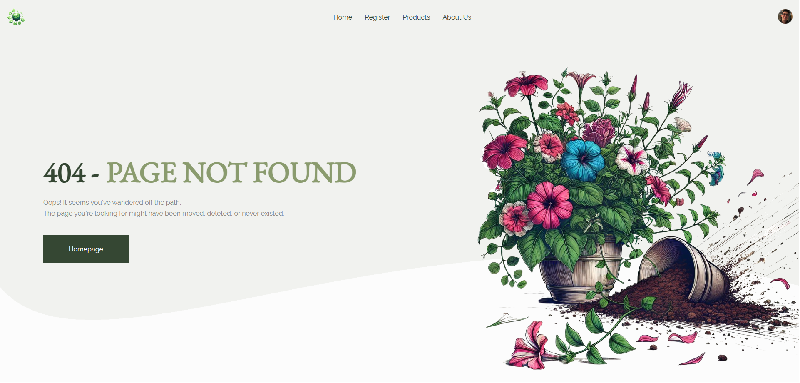

[JAVASCRIPT__BADGE]: https://img.shields.io/badge/JavaScript-000?style=for-the-badge&logo=javascript
[TYPESCRIPT__BADGE]: https://img.shields.io/badge/TypeScript-007ACC?style=for-the-badge&logo=typescript&logoColor=white
[REACT__BADGE]: https://img.shields.io/badge/React-61DAFB?style=for-the-badge&logo=react&logoColor=black
[CSS3__BADGE]: https://img.shields.io/badge/CSS3-%231572B6.svg?style=for-the-badge&logo=css3&logoColor=white
[PRISMA__BADGE]: https://img.shields.io/badge/Prisma-2D3748?style=for-the-badge&logo=prisma&logoColor=white
[SQLITE__BADGE]: https://img.shields.io/badge/SQLite-003B57?style=for-the-badge&logo=sqlite&logoColor=white
[VITE__BADGE]: https://img.shields.io/badge/Vite-646CFF?style=for-the-badge&logo=vite&logoColor=white
[CLERK__BADGE]: https://img.shields.io/badge/Clerk-3F4451?style=for-the-badge&logo=clerk&logoColor=white

<p align="center"> 
<h1 align="center" style="font-weight: bold;">Green Sphere Store</h1>
<div align="center">

![JAVASCRIPT][JAVASCRIPT__BADGE]
![TYPESCRIPT][TYPESCRIPT__BADGE]
![REACT][REACT__BADGE]
![CSS3][CSS3__BADGE]
![PRISMA][PRISMA__BADGE]
![SQLITE][SQLITE__BADGE]
![VITE][VITE__BADGE]
![CLERK][CLERK__BADGE]

</div>

</div>
<p align="center">
 <a href="#about">About</a> • 
 <a href="#frontend">Frontend Dependencies</a> • 
 <a href="#backend">Backend Dependencies</a> • 
 <a href="#getting-started">Getting Started</a> • 
 <a href="#features">Features and Functionality</a> • 
 <a href="#colab">Collaborators</a> •
 <a href="#contribute">Contribute</a> •
 <a href="#guidelines">Contribution Guidelines</a> •
 <a href="#resources">Useful Resources</a>
</p>

<h2 id="about">📌 About</h2>

The **Green Sphere Store** is a project designed to create a responsive and functional e-commerce platform for a fictional plant store. Users can browse plants, register new plants, and learn more about the developers.

The project is implemented using React, TypeScript, and Clerk for user authentication. It features dynamic plant registration and display, route protection, and user-friendly UI interactions.

<h2>⚙️ Dependencies</h2>

There are two folders on this project, the Frontend **GreenSphere-web** and the Backend **GreenSphere-api**:

<h3 id="frontend">Frontend (<kbd>GreenSphere-web</kbd>)</h3>

This folder contains the frontend of the GreenSphere Store, a web application built using React and TypeScript for an e-commerce platform focused on plants.

**Environment**

- Node.js: >=16.0.0
- npm: >=8.0.0
- Vite: ^6.0.5

**Dependencies**

| Dependency                                        | Version            | Description                                              |
| ------------------------------------------------- | ------------------ | -------------------------------------------------------- |
| <kbd>@clerk/clerk-react</kbd>                     | <kbd>^5.21.0</kbd> | Clerk authentication library for React.                  |
| <kbd>@clerk/elements</kbd>                        | <kbd>^0.22.5</kbd> | UI components for Clerk authentication.                  |
| <kbd>@hookform/resolvers</kbd>                    | <kbd>^3.9.1</kbd>  | Validation resolvers for React Hook Form.                |
| <kbd>@splidejs/react-splide</kbd>                 | <kbd>^0.7.12</kbd> | React wrapper for Splide.js carousel library.            |
| <kbd>@splidejs/splide</kbd>                       | <kbd>^4.1.4</kbd>  | Core Splide.js carousel library.                         |
| <kbd>@splidejs/splide-extension-auto-scroll</kbd> | <kbd>^0.5.3</kbd>  | Auto-scroll extension for Splide.js.                     |
| <kbd>axios</kbd>                                  | <kbd>^1.7.9</kbd>  | Promise-based HTTP client for API calls.                 |
| <kbd>react</kbd>                                  | <kbd>^18.3.1</kbd> | Core React library.                                      |
| <kbd>react-dom</kbd>                              | <kbd>^18.3.1</kbd> | React library for DOM rendering.                         |
| <kbd>react-hook-form</kbd>                        | <kbd>^7.54.2</kbd> | Library for building performant forms in React.          |
| <kbd>react-icons</kbd>                            | <kbd>^5.4.0</kbd>  | Popular icon library for React.                          |
| <kbd>react-router-dom</kbd>                       | <kbd>^7.1.1</kbd>  | React Router library for navigation.                     |
| <kbd>zod</kbd>                                    | <kbd>^3.24.1</kbd> | Schema validation library for TypeScript and JavaScript. |

**Develop Dependencies**

| Dev Dependency                         | Version             | Description                                                |
| -------------------------------------- | ------------------- | ---------------------------------------------------------- |
| <kbd>@eslint/js</kbd>                  | <kbd>^9.17.0</kbd>  | ESLint core library for linting JavaScript and TypeScript. |
| <kbd>@types/node</kbd>                 | <kbd>^22.10.5</kbd> | TypeScript types for Node.js.                              |
| <kbd>@types/react</kbd>                | <kbd>^18.3.18</kbd> | TypeScript types for React.                                |
| <kbd>@types/react-dom</kbd>            | <kbd>^18.3.5</kbd>  | TypeScript types for React DOM.                            |
| <kbd>@vitejs/plugin-react</kbd>        | <kbd>^4.3.4</kbd>   | Vite plugin for React support.                             |
| <kbd>eslint</kbd>                      | <kbd>^9.17.0</kbd>  | ESLint core for linting JavaScript and TypeScript.         |
| <kbd>eslint-plugin-react-hooks</kbd>   | <kbd>^5.0.0</kbd>   | ESLint rules for React Hooks.                              |
| <kbd>eslint-plugin-react-refresh</kbd> | <kbd>^0.4.16</kbd>  | ESLint plugin for React Refresh.                           |
| <kbd>globals</kbd>                     | <kbd>^15.14.0</kbd> | Global variables for ESLint.                               |
| <kbd>patch-package</kbd>               | <kbd>^8.0.0</kbd>   | Tool to patch npm package files.                           |
| <kbd>typescript</kbd>                  | <kbd>~5.6.2</kbd>   | TypeScript compiler.                                       |
| <kbd>vite</kbd>                        | <kbd>^6.0.5</kbd>   | Modern front-end build tool.                               |

<kbd>
**Folder Structure**

```plaintext
GreenSphere-web/
├── node_modules/         # Installed npm packages
├── public/               # Static files (e.g., images, favicon)
├── src/                  # Source code
│ ├── assets/             # Static assets used in the project (e.g., images, fonts)
│ ├── components/         # Reusable React components
│ ├── hooks/              # Custom React hooks
│ ├── pages/              # Pages of the application (e.g., Home, Register)
│ ├── schemas/            # Zod schemas for form validation
│ ├── services/           # API calls and service logic
│ ├── types/              # TypeScript type definitions
│ ├── App.tsx             # Main App component
│ ├── App.css             # Global CSS for the App component
│ ├── index.css           # Global styles
│ ├── main.tsx            # Entry point of the React application
│ └── vite-env.d.ts       # Vite environment types
├── index.html            # Main HTML file for the app
├── package.json          # Project dependencies and scripts
├── tsconfig.app.json     # TypeScript configuration for the app
├── tsconfig.json         # Main TypeScript configuration
└── vite.config.ts        # Vite configuration file
```

**Notes**

- Clerk Integration: Clerk handles authentication, including sign-in, sign-up, and user profiles.
- API Calls: Axios is used to interact with the backend API.

<h3 id="backend">Backend (<kbd>GreenSphere-api</kbd>)</h3>
This folder contains the backend API for the GreenSphere project. It handles server-side logic, database operations, and provides endpoints for the frontend to interact with.

**Environment**

- Node.js: >=16.0.0
- npm: >=8.0.0
- Database: SQLite (or other databases supported by Prisma)

**Dependencies**

| Dependency                | Version            | Description                                                   |
| ------------------------- | ------------------ | ------------------------------------------------------------- |
| <kbd>@prisma/client</kbd> | <kbd>^6.1.0</kbd>  | Prisma ORM client for database interactions.                  |
| <kbd>cors</kbd>           | <kbd>^2.8.5</kbd>  | Middleware for enabling Cross-Origin Resource Sharing (CORS). |
| <kbd>express</kbd>        | <kbd>^4.21.2</kbd> | Web framework for building APIs.                              |
| <kbd>zod</kbd>            | <kbd>^3.24.1</kbd> | Schema validation library for request payloads.               |

**Develop Dependencies**

| Dev Dependency            | Version      | Description                                                         |
| ------------------------- | ------------ | ------------------------------------------------------------------- |
| <kbd>@types/cors</kbd>    | <kbd>^2.8.17 | TypeScript types for CORS.                                          |
| <kbd>@types/express</kbd> | <kbd>^5.0.0  | TypeScript types for Express.                                       |
| <kbd>nodemon</kbd>        | <kbd>^3.1.9  | Tool for automatically restarting the server during development.    |
| <kbd>ts-node</kbd>        | <kbd>^10.9.2 | TypeScript execution environment for Node.js.                       |
| <kbd>ts-node-dev</kbd>    | <kbd>^2.0.0  | Enhanced development environment for TypeScript with hot-reloading. |
| <kbd>typescript</kbd>     | <kbd>^5.7.2  | TypeScript compiler.                                                |

**Folder Structure**

```plaintext
GreenSphere-api/
├── dist/                        # Compiled JavaScript files (output of TypeScript build)
├── node_modules/                # Installed npm packages
├── prisma/                      # Prisma schema and migrations
│   ├── migrations/              # Database migration files
│   └── schema.prisma            # Prisma schema definition
├── src/                         # Source code
│   └── server/                  # Server-side logic and entry point
│       ├── routes/              # API route handlers
│       │   ├── createPlant.ts   # Route to create a new plant
│       │   ├── deletePlant.ts   # Route to delete a plant
│       │   ├── getPlants.ts     # Route to fetch all plants
│       │   ├── typeRoute.ts     # Route to handle plant types
│       │   └── index.ts         # Main router entry point
│       └── index.ts             # Main server entry point
├── package.json                 # Project dependencies and scripts
└── tsconfig.json                # TypeScript configuration
```

**Notes:**

- The backend uses TypeScript to ensure type safety.
- Zod is used for schema validation of request payloads.
- Prisma handles database interactions, making querying and updating data easier.

<h2 id="getting-started">🚀 Getting started</h2>
Clone the repository to your local machine:

<h3>Cloning</h3>

```bash
git clone https://github.com/g-Miyata/squard-desafio2-GreenSphere.git
```

<h3>Starting the Frontend</h3>

1. **Navigate to the Frontend folder:**

```bash
cd GreenSphere-web
```

2. **Install dependencies:**

```bash
npm install
```

3. **Start the development server:**

```bash
npm run dev
```

<h3>Starting the Backend</h3>

1. **Navigate to the Backend folder:**

```bash
cd GreenSphere-api
```

2. **Install dependencies:**

```bash
npm install
```

3. **Initialize Prisma Client**

- run:

```bash
npx prisma generate
```

- install prisma packages.

4. **Start the development server:**

```bash
npm run dev
```

<h2 id="features">📜 Features and Functionality</h2>

<p>Here are the main features of the application:</P>

<p align="center">

| Feature                           | Description                                                                                                                         |
| --------------------------------- | ----------------------------------------------------------------------------------------------------------------------------------- |
| <kbd>Header</kbd>                 | Displays navigation links to <kbd>Home</kbd>, <kbd>Register</kbd>, <kbd>Products</kbd> and <kbd>About Us</kbd> pages.               |
| <kbd>Footer</kbd>                 | Provides additional information and site navigation.                                                                                |
| <kbd>Authentication</kbd>         | User authentication implemented with Clerk.                                                                                         |
| <kbd>Dynamic Plant Display</kbd>  | Shows plants categorized by sections such as "Plants in Sale".                                                                      |
| <kbd>Plant Registration</kbd>     | Modify the description of an existing task.                                                                                         |
| <kbd>Detailed Product Pages</kbd> | Mark a task as completed or incomplete.                                                                                             |
| <kbd>Sign-In Page</kbd>           | Allows users to log in using Clerk's authentication system.                                                                         |
| <kbd>Welcome Page</kbd>           | A temporary page shown after the user logs in, welcoming them to the application.                                                   |
| <kbd>Protected Routes</kbd>       | Ensures that only authenticated users can access certain pages, such as the plant registration form or the welcome page.            |
| <kbd>Responsiveness</kbd>         | The application is fully responsive, ensuring an optimal experience across devices, including desktops, tablets, and mobile phones. |
| <kbd>Search and Filtering</kbd>   | Includes filters and a search bar for finding plants by specific categories or prices.                                              |
| <kbd>UserButton</kbd>             | Provided by Clerk, it allows users to log out and view their profile photo directly in the header.                                  |
| <kbd>Not Found Page</kbd>         | A creative 404 error page that appears when a user tries to access an invalid or non-existent route.                                |

</p>​

### Preview of the Application

<h3 align="center">Sign-in Page</h3>
<p align="center">Allows users to log in using Clerk's authentication:</p>
<p align="center">
  
</p>

<h3 align="center">Welcome Page</h3>
<p align="center">A temporary page shown after the user logs in</p>
<p align="center">
  
</p>

<h3 align="center">Home Page</h3>
<p align="center">The home page was divided into 5 sections <kbd>main</kbd>, <kbd>instructions</kbd>, <kbd>outdoor</kbd>, <kbd>bestSelling</kbd> and <kbd>inSale</kbd>:</p>

**1. Home - main section:**

<p align="center">
  
</p>

**2. Home - instructions section:**

<p align="center">
  
</p>

**3. Home - outdoor section:**

<p align="center">
  
</p>

**4. Home - bestSelling section:**

<p align="center">
  
</p>

**5. Home - inSale section:**

<p align="center">
  
</p>

<h3 align="center">Register Page</h3>
<p align="center">Allows users to add new plants through a form:</p>
<p align="center">
  
</p>

<h3 align="center">Products Page</h3>
<p align="center">Shows plants categorized</p>
<p align="center">
  
</p>

<h3 align="center">Plant Page</h3>
<p align="center">Shows the plant selected by the user</p>
<p align="center">
  
</p>

<h3 align="center">About Us Page</h3>
<p align="center">Allows users to learn more about developers by clicking on a card:</p>
<p align="center">
  
</p>

<h3 align="center">Not Found Page</h3>
<p align="center">A creative 404 error page:</p>
<p align="center">
  
</p>

<p>The application uses SQLite as the database to store and manage data persistently, ensuring reliability and efficiency. The Prisma ORM is utilized to simplify database operations, providing an abstraction layer for querying, inserting, updating, and deleting data.</p>

**1. Routes and Methods**

<p align="center">

| <p align="center" style="margin: 0;" >Method</p> | <p align="center" style="margin: 0;" >Route</p> | <p align="center" style="margin: 0;" >Description</p> |
| ------------------------------------------------ | ----------------------------------------------- | ----------------------------------------------------- |
| <p align="center" style="margin: 0;" >GET</p>    | <kbd>/plants</kbd>                              | Retrieves a list of all plants.                       |
| <p align="center" style="margin: 0;" >GET</p>    | <kbd>/plants/:id</kbd>                          | Retrieves details of a specific plant by ID.          |
| <p align="center" style="margin: 0;" >DELETE</p> | <kbd>/plants/:id</kbd>                          | Deletes a plant by ID.                                |
| <p align="center" style="margin: 0;" >POST</p>   | <kbd>/register</kbd>                            | Adds a new plant to the database.                     |
| <p align="center" style="margin: 0;" >GET</p>    | <kbd>/types</kbd>                               | Retrieves a list of all plants types.                 |

</p>

**2. Payloads and Responses**

#### GET `/plants`

- **Request Payload: (No body required)**
- **Response Payload:**

  ```json
  [
    {
      "id": 1,
      "name": "Echinocereus Cactus",
      "subtitle": "A Majestic Addition to Your Plant Collection",
      "label": "Indoor",
      "price": 139.99,
      "isInSale": true,
      "discountPercentage": 20,
      "features": "Species: Echinocereus spp. Mature Size: 10-30cm...",
      "description": "A beautiful indoor cactus...",
      "imgUrl": "https://http2.mlstatic.com/D_NQ_NP_833120-MLB75616703076_042024-O.webp",
      "typeId": 1
    },
    {
      "id": 2,
      "name": "Aloe Vera",
      "subtitle": "A Versatile Medicinal Plant",
      "label": "Indoor",
      "price": 89.99,
      "isInSale": true,
      "discountPercentage": 15,
      "features": "Species: Aloe barbadensis miller. Mature Size: Can grow up to 24 inches (60 cm) in height...",
      "description": "Aloe Vera is known for its healing properties and low-maintenance care...",
      "imgUrl": "https://static.wixstatic.com/media/00cb6f_4bea27398ba84ca4b75ca5f619e0e8a9~mv2.jpg/v1/fill/w_4608,h_3072,al_c,q_90/Aloe%20Vera%20Extra%20Pure.jpg",
      "typeId": 2
    },
    {
      "id": 3,
      "name": "Snake Plant",
      "subtitle": "The Perfect Air Purifier",
      "label": "Indoor",
      "price": 49.99,
      "isInSale": false,
      "discountPercentage": 0,
      "features": "Species: Sansevieria trifasciata. Mature Size: Typically grows up to 3 feet (90 cm) indoors...",
      "description": "Snake Plant, also known as Mother-in-law's Tongue, is a hardy plant that tolerates low light and infrequent watering. Ideal for beginners...",
      "imgUrl": "https://www.houseplant.co.uk/cdn/shop/files/DSC00422-2.jpg?v=1724785336&width=1946",
      "typeId": 3
    }
  ]
  ```

#### GET `/plants/:id` for id: 1

- **Request Payload: (No body required)**
- **Response Payload:**

  ```json
  {
    "id": 1,
    "name": "Echinocereus Cactus",
    "subtitle": "A Majestic Addition to Your Plant Collection",
    "label": "Indoor",
    "price": 139.99,
    "isInSale": true,
    "discountPercentage": 20,
    "features": "Species: Echinocereus spp. Mature Size: 10-30cm...",
    "description": "A beautiful indoor cactus...",
    "imgUrl": "https://http2.mlstatic.com/D_NQ_NP_833120-MLB75616703076_042024-O.webp",
    "typeId": 1
  }
  ```

#### DELETE `/plants/:id` for id: 1

- **Request Payload: (No body required)**
- **Response Payload:**

  ```json
  {
    "id": 1,
    "name": "Echinocereus Cactus",
    "subtitle": "A Majestic Addition to Your Plant Collection",
    "label": "Indoor",
    "price": 139.99,
    "isInSale": true,
    "discountPercentage": 20,
    "features": "Species: Echinocereus spp. Mature Size: 10-30cm...",
    "description": "A beautiful indoor cactus...",
    "imgUrl": "https://http2.mlstatic.com/D_NQ_NP_833120-MLB75616703076_042024-O.webp",
    "typeId": 1
  }
  ```

#### POST `/register`

- **Request Payload:**

  ```json
  {
    "name": "Echinocereus Cactus",
    "subtitle": "A Majestic Addition to Your Plant Collection",
    "price": 139.99,
    "isInSale": true,
    "label": "Indoor",
    "discountPercentage": 20,
    "features": "Species: Echinocereus spp. Mature Size: 10-30cm.",
    "description": "A beautiful indoor cactus.",
    "type": 1,
    "imgUrl": "defaultImg.png" //this feature is not yet implemented, so it is not necessary to enter a url for the registration, the field is defined by a default image
  }
  ```

- **Response Payload:**

  ```json
  {
    "id": 1,
    "name": "Echinocereus Cactus",
    "subtitle": "A Majestic Addition to Your Plant Collection",
    "price": 139.99,
    "isInSale": true,
    "label": "Indoor",
    "discountPercentage": 20,
    "features": "Species: Echinocereus spp. Mature Size: 10-30cm.",
    "description": "A beautiful indoor cactus.",
    "type": 1,
    "imgUrl": "defaultImg.png" //this feature is not yet implemented, so it is not necessary to enter a url for the registration, the field is defined by a default image
  }
  ```

#### GET `/types`

- **Request Payload: (No body required)**
- **Request Payload:**

  ```json
  [
    {
      "id": 1,
      "typeName": "cactus"
    },
    {
      "id": 2,
      "typeName": "Succulent"
    },
    {
      "id": 3,
      "typeName": "air-purifying"
    }
  ]
  ```

**3. Post Validation Rules**

When sending data to the `/plants` endpoint (POST), the following validation rules are applied using **Zod**:

<p align="center">

| **Field**            | **Type**  | **Validation Rules**                 |
| -------------------- | --------- | ------------------------------------ |
| `name`               | `string`  | Must be at least 3 characters long.  |
| `subtitle`           | `string`  | Must be at least 3 characters long.  |
| `price`              | `number`  | Must be a positive number.           |
| `isInSale`           | `boolean` | Must be `true` or `false`.           |
| `discountPercentage` | `number`  | Must be between 0 and 100.           |
| `label`              | `enum`    | Must be one of: `Indoor`, `Outdoor`. |
| `features`           | `string`  | Must be at least 10 characters long. |
| `description`        | `string`  | Must be at least 10 characters long. |
| `imgUrl`             | `string`  | Must be a valid image URL.           |
| `type`               | `number`  | Must reference a valid type ID.      |

</p>

**3. Errors Responses**

<p>When interacting with the API, different status codes are returned based on the outcome of the request. Below is a list of possible status codes and their meanings:</p>

<p align="center">

| **Status Code**                                   | **Description**                                                                  |
| ------------------------------------------------- | -------------------------------------------------------------------------------- |
| <p align="center" style="margin: 0;" >**200**</p> | Request successful. The operation completed as expected.                         |
| <p align="center" style="margin: 0;" >**201**</p> | Resource created successfully. Returned when a new plant or resource is created. |
| <p align="center" style="margin: 0;" >**400**</p> | Bad request. The payload sent is invalid or missing required fields.             |
| <p align="center" style="margin: 0;" >**404**</p> | Not found. The requested resource does not exist.                                |
| <p align="center" style="margin: 0;" >**500**</p> | Internal server error. An unexpected error occurred on the server.               |

</p>

**4. Database Structure**

`Prisma Schema Models`

<p align="center">

1. `Model Plant`

</p>
<p align="center">

| **Field**            | **Type**                                            | **Description**                                                 |
| -------------------- | --------------------------------------------------- | --------------------------------------------------------------- |
| `id`                 | `Int` @id @default(autoincrement())                 | Primary Key autoincrement                                       |
| `name`               | `String`                                            | Name of the plant                                               |
| `subtitle`           | `String`                                            | Foreign Key referencing Plant Types                             |
| `label`              | `String`                                            | Price of the plant                                              |
| `price`              | `Float`                                             | Price of the plant                                              |
| `isInSale`           | `boolean`                                           | Indicates if the plant is on sale                               |
| `discountPercentage` | `Float`                                             | Percentage discount if on sale                                  |
| `features`           | `String`                                            | Key features of the plant                                       |
| `description`        | `String`                                            | Detailed description of the plant                               |
| `imgUrl`             | `String`                                            | URL for the plant's image                                       |
| `type`               | `Type`                                              | Type of the plant relation (fields: [typeId], references: [id]) |
| `typeId`             | `Int` @relation(fields: [typeId], references: [id]) | Timestamp of creation                                           |

</p>

2. `Model Type`

<p align="center">

| **Field**  | **Type**                            | **Description**                                               |
| ---------- | ----------------------------------- | ------------------------------------------------------------- |
| `id`       | `Int` @id @default(autoincrement()) | Primary Key with auto-increment                               |
| `typeName` | `String`                            | Name of the plant type                                        |
| `plants`   | `Plant[]`                           | Relation to the `Plant` model, representing associated plants |

**5. Technologies Used**

- Framework: Express.js
- ORM: Prisma
- Validation: Zod
- Database: SQLite

<h2 id="colab">🤝 Collaborators</h2>

<p>This project is the result of the collaborative efforts of a talented and dedicated team. Below is a list of all contributors who worked together to bring this project to life.</P>

<table align="center">
  <tr style="display: flex; justify-content: space-around;" >
    <td align="center">
      <br>
      <b>Guilherme Miyata</b><br>
      <a href="https://github.com/g-Miyata">
        
      </a>
      <a href="https://www.linkedin.com/in/guilherme-miyata-612a71219/">
        
      </a>
    </td>
    <td align="center">
      <br>
      <b>Francisco G. Maldonado</b><br>
      <a href="https://github.com/FranciscoGMaldonado">
        
      </a>
      <a href="https://www.linkedin.com/in/francisco-guatura-maldonado-290402209/">
        
      </a>
    </td>
        <td align="center">
      <br>
      <b>Vinicius Vezono</b><br>
      <a href="https://github.com/ViniciusVezono">
        
      </a>
      <a href="https://www.linkedin.com/in/vinicius-vezono/">
        
      </a>
    </td>
  </tr>
</table>

<h2 id="contribute">📫 Contribute</h2>

Contributions are always welcome! Follow the steps below to contribute to this project.

<h3>🛠️ How to Contribute</h3>

1. **Fork the repository**: Click on the `Fork` button in the top-right corner of this page to create a copy of the repository in your GitHub account.

2. **Clone your forked repository**:

   ```bash
   git clone https://github.com/g-Miyata/squard-desafio2-GreenSphere.git
   ```

3. **Create a new branch for your feature, bug, fix...:**

   ```bash
   git checkout -b feat/your-feature-name
   ```

4. **Test your changes: Ensure your feature or fix works as expected and doesn't break anything.**

- Follow the coding standards of the project.
- Write clear and concise commit messages.

6. **Commit you changes**:

   ```bash
   git commit -m "Add detailed description of what you changed" your-username/project-name.git
   ```

7. **Push your changes to the github repository:**

   ```bash
   git push -u origin feat/your-feature-name
   ```

8. **Open a Pull Request:**

- Go to the original repository.

- Click on the Pull Requests tab and open a new pull request.

- Describe your changes, the issue it solves (if applicable), and attach screenshots (if it involves UI changes)

**For more information 📢 ❗ 🚨**

- Check out the [Team Workflow Instructions on Github](./INFO.md) and [Commit Pattern](https://www.conventionalcommits.org/en/v1.0.0/)

<h3 id="guidelines">📐 Contribution Guidelines</h3>

To maintain a consistent codebase, please follow these guidelines:

- **Code Standards:** Adhere to the existing coding style (e.g., indentation, naming conventions).
- **Commit Messages:** Use meaningful commit messages in the format:
  ```bash
   type: short description
  ```
  **Examples:**
- `fix: correct button alignment on mobile`

- `feat: add new user profile page`

- `docs: update README.md`

- **Documentation:** If your changes add or modify functionality, update the documentation accordingly.
- **Pull Request Checklist:**

  - Make sure your branch is up-to-date with the `main` branch.

  - Ensure your code is tested and works correctly.

  - Provide clear descriptions in the pull request.

<h3 id="resources">📄 Useful Resources</h3>

- [📚 Clerk Docs](https://clerk.com/docs/quickstarts/setup-clerk)
- [🎥 Clerk Video Example](https://www.youtube.com/watch?v=QQ2DkD6rqSs&t=1153s)
- [📚 Splide React Docs](https://splidejs.com/integration/react-splide/)
- [🧐 Some Splie Examples](https://splidejs.com/)
- [🎥 Splie Video Example](https://www.youtube.com/watch?v=NR9cyUTMmNo)
- [🔀 React Router](https://reactrouter.com/home)
- [📝 Commit pattern](https://www.conventionalcommits.org/en/v1.0.0/)
- [🤝 Team Workflow Instructions on Github](./INFO.md)
